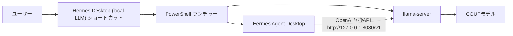
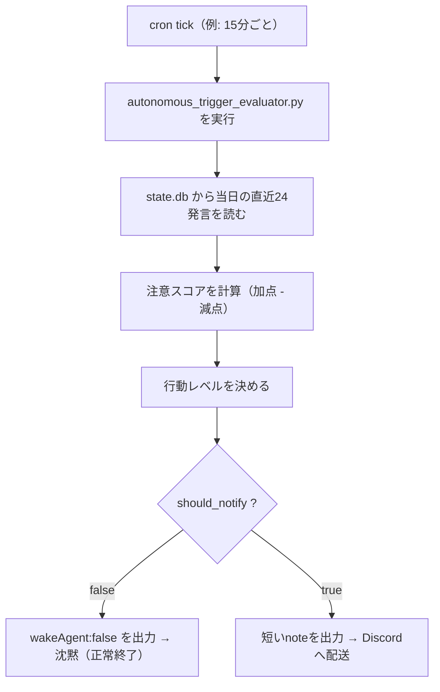
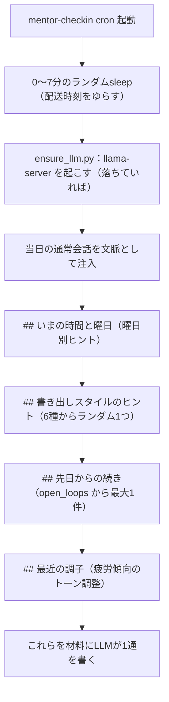

# Hermes Agent Desktop にローカルLLMを導入する手順

Hermes Agent Desktop を、LM Studio なしでローカルLLMにつなぐための手順です。

このREADMEは、Windows環境で実際にかなり苦戦しながら構築した内容をまとめています。
結論から言うと、`Hermes Agent Desktop + llama-server + GGUFモデル` の構成で動きます。

Discord DM、Obsidian、Codex skills、各種Tool useまで含めた個人メンター秘書運用は、次の詳細メモに分けています。

- [Hermes Agent Desktop を個人メンター秘書として運用する設定メモ](docs/personal-mentor-discord-obsidian-gemma4.md)
- [Hermes Agent Desktop 自律実行とGateway運用メモ](docs/autonomous-codex-gateway-ops.md)
- [Hermes Agent Desktop セットアップ学びチェックリスト](docs/setup-lessons-checklist.md)
- [Hermes Agent Desktop を人間らしくする設定メモ（記憶・ゆらぎ・調子・文体）](docs/human-like-behavior.md)
- [クラウドNemotronを手動切替で使う（Codex不在時の代役）](docs/nemotron-cloud-model.md)
- [安全な設定サンプル](examples/)

## AIへ渡すとき

別のAIにセットアップを依頼するときは、このREADMEと詳細メモを両方読ませてください。

依頼文の例:

```text
このリポジトリを読んで、Windows環境のHermes Agent Desktopを
Gemma 4ローカルLLM、Discord DM、Obsidian、Codex skills連携込みで
セットアップしてください。

まずREADME.mdを読み、次に docs/personal-mentor-discord-obsidian-gemma4.md と
docs/autonomous-codex-gateway-ops.md と docs/setup-lessons-checklist.md を読んでください。
必要に応じて examples/ の設定サンプルを使ってください。
秘密情報や実パスは推測せず、必要なものだけ私に確認してください。
```

このリポジトリには、Bot Token、DiscordユーザーID、DMチャンネルID、個人ノート本文は入れていません。
AIは手順を再現できますが、秘密情報と実ファイルパスはユーザーのローカル環境で入力する必要があります。

## できること

- Hermes Agent Desktop 単体でローカルLLMを使う
- LM Studioを起動せずにGGUFモデルを使う
- Hermes Desktop起動時に `llama-server` も自動起動する
- Hermes Desktopを閉じたら `llama-server` も自動終了する
- Gemma 4の思考を有効化し、制限なし寄りで動かす
- Discord DMで個人メンター秘書として使う
- Obsidian Vaultを参照し、成果物を専用フォルダへ出す
- Obsidianの `hermes/homework` にNext Actionsを宿題としてためる
- 5分cronでCodex自律runnerを動かし、空き時間に宿題を進める
- 宿題完了時にDiscordへ報告し、Obsidianファイル名へ `[完了] ` を付ける
- Gatewayの自己再起動を外側Scheduled Taskで安全に実行する
- xAI OAuthと `x_search` / `x_research` でXの公開投稿を検索・深掘りする
- Discord向け内部思考ガードでローカルLLMの漏れを抑える
- Gateway外側watchdogでGateway停止を復旧する
- Codex skillsをHermes側でも参照する
- クラウドのNVIDIA Nemotron(550B)を `/model` で手動切替し、Codex不在時の代役にする
- 日次ダイジェストで当日の会話を要約し、未解決トピックを翌日にそっとフォローする
- チェックインの送信タイミングを数分ゆらし、曜日と時間帯に合わせて声をかける
- 疲労の傾向を数日分追跡し、提案の量とトーンを自動で控えめにする
- チェックイン直前に `llama-server` を自動起動し、使い終わったら自動で回収する
- `approvals.mode: off` で承認なしのYOLO運用にする

## 全体構成



`llama-server` は、llama.cppに含まれるOpenAI互換のHTTPサーバーです。
Hermes Desktop側から見ると、ローカルにあるOpenAI互換エンドポイントへ接続しているだけです。

参考:

- [llama.cpp Server documentation](https://www.mintlify.com/ggml-org/llama.cpp/inference/server)
- [google/gemma-4-12B-it-qat-q4_0-gguf](https://huggingface.co/google/gemma-4-12B-it-qat-q4_0-gguf)

## 検証環境

今回の検証環境です。

| 項目 | 内容 |
|---|---|
| OS | Windows |
| GPU | NVIDIA GeForce RTX 4070 Ti SUPER 16GB |
| Hermes Agent Desktop | v0.15.1 |
| llama.cpp | CUDA対応版 b9498 |
| モデル | `gemma-4-12b-it-qat-q4_0.gguf` |
| コンテキスト長 | 262144 |
| KVキャッシュ | `q8_0` |
| APIエンドポイント | `http://127.0.0.1:8080/v1` |

最初はQ8とQ6_Kを使いました。
現在は公式Google QAT Q4_0モデルを使い、256Kコンテキストで運用しています。

## 重要な結論

今回の一番大きな学びはここです。

Hermes CLI用の設定と、Hermes Desktop用の設定は別の場所を見ていることがあります。

```text
CLIで見ていた設定:
C:\Users\<USER>\.hermes\config.yaml

Desktopが見ていた設定:
C:\Users\<USER>\AppData\Local\hermes\config.yaml
```

Desktopがどの設定を読んでいるかは、次のAPIで確認できます。

```powershell
Invoke-RestMethod http://127.0.0.1:9120/api/status | ConvertTo-Json -Depth 5
```

`config_path` に出るパスが、Desktopが実際に読んでいる設定です。
ここを見ずに `.hermes\config.yaml` だけ直すと、CLIでは動くのにDesktopでは無反応になります。

## 1. GGUFモデルを用意する

今回はGoogle公式のGemma 4 12B Instruct QAT GGUFを使いました。

標準にするモデルはこれです。

```text
gemma-4-12b-it-qat-q4_0.gguf
```

Hugging Face repo:

```text
google/gemma-4-12B-it-qat-q4_0-gguf
```

Q8とQ6_Kも動きました。
ただし、現在は公式QAT Q4_0を採用しています。

配置例:

```text
C:\Users\<USER>\.cache\lm-studio\models\google\gemma-4-12B-it-qat-q4_0-gguf\gemma-4-12b-it-qat-q4_0.gguf
```

`huggingface-cli download` などでローカルへ保存しておけば使えます。
LM Studio本体を起動する必要はありません。

## 2. Gemma 4対応のllama-serverを用意する

古いllama.cppでは、Gemma 4を読み込めない場合があります。
今回、古いllama.cppでは次のようなエラーが出ました。

```text
unknown model architecture: 'gemma4'
```

この場合は、新しいllama.cppを使ってください。
今回の検証では、CUDA 12.4対応の `llama.cpp b9498` で動きました。

配置例:

```text
C:\Users\<USER>\tools\llama.cpp-b9498-cuda-12.4\llama-server.exe
```

## 3. llama-serverを起動する

最小構成は次のようなコマンドです。

```powershell
& "C:\Users\<USER>\tools\llama.cpp-b9498-cuda-12.4\llama-server.exe" `
  -m "C:\Users\<USER>\.cache\lm-studio\models\google\gemma-4-12B-it-qat-q4_0-gguf\gemma-4-12b-it-qat-q4_0.gguf" `
  --alias gemma-4-12b-it `
  --host 127.0.0.1 `
  --port 8080 `
  --ctx-size 262144 `
  --parallel 1 `
  --reasoning on `
  --reasoning-budget -1 `
  --reasoning-format deepseek `
  --cache-type-k q8_0 `
  --cache-type-v q8_0
```

ポイントは `--alias` です。
Hermes側ではこの名前をモデル名として使います。

`--reasoning on` と `--reasoning-budget -1` は、Gemma 4の思考を有効にして制限なし寄りにする設定です。
思考が不要な場合は `--reasoning off` に戻せます。

256KコンテキストではKVキャッシュのVRAM使用量が増えます。
今回の環境では `--cache-type-k q8_0` と `--cache-type-v q8_0` を使い、公式QAT Q4_0モデルを256Kで起動できました。

起動確認:

```powershell
Invoke-RestMethod http://127.0.0.1:8080/v1/models | ConvertTo-Json -Depth 5
```

`id` に `gemma-4-12b-it` が出ればOKです。

## 4. Hermes Desktop側のconfig.yamlを変更する

まず、Desktopが読んでいる設定ファイルを確認します。

```powershell
Invoke-RestMethod http://127.0.0.1:9120/api/status | ConvertTo-Json -Depth 5
```

今回の環境では、次のファイルでした。

```text
C:\Users\<USER>\AppData\Local\hermes\config.yaml
```

このファイルの `model` と `approvals` を次のように変更します。

```yaml
model:
  base_url: http://127.0.0.1:8080/v1
  default: gemma-4-12b-it
  provider: custom
  context_length: 262144
  api_key: not-needed

approvals:
  mode: off
```

`approvals.mode: off` は、Hermesにツール実行を承認なしで任せる設定です。
便利ですが、危険なコマンドも承認なしで実行されます。
自分だけのローカル環境で、リスクを理解したうえで使ってください。

## 5. 64K以上のコンテキストが必要

Hermes Agentは、モデルのコンテキスト長が短いと起動できないことがあります。
今回、32768では次のエラーが出ました。

```text
Model gemma-4-12b-it has a context window of 32,768 tokens,
which is below the minimum 64,000 required by Hermes Agent.
```

そのため、`llama-server` とHermes設定の両方を64K以上にします。
現在は公式QAT Q4_0モデルで、256Kにそろえて運用しています。

`llama-server`:

```powershell
--ctx-size 262144
--cache-type-k q8_0
--cache-type-v q8_0
```

Hermes:

```yaml
model:
  context_length: 262144
```

## 6. Hermes Desktopを再起動する

設定を変更したら、Hermes Desktopを再起動します。

```powershell
Get-CimInstance Win32_Process |
  Where-Object { $_.Name -eq "Hermes.exe" } |
  ForEach-Object { Stop-Process -Id $_.ProcessId -Force }
```

その後、通常通りHermes Desktopを起動します。

## 7. 動作確認

Hermes側の認識を確認します。

```powershell
Invoke-RestMethod http://127.0.0.1:9120/api/model/info | ConvertTo-Json -Depth 5
```

期待する出力:

```json
{
  "model": "gemma-4-12b-it",
  "provider": "custom",
  "config_context_length": 262144,
  "effective_context_length": 262144
}
```

Hermes Desktopで `ハロー` と送って返事が返れば成功です。

## 8. Desktopで無反応に見えるとき

まずログを見ます。

```powershell
Get-Content "C:\Users\<USER>\AppData\Local\hermes\logs\agent.log" -Tail 100
Get-Content "C:\Users\<USER>\AppData\Local\hermes\logs\errors.log" -Tail 100
```

今回の失敗では、裏で次のエラーが出ていました。

```text
provider=copilot base_url=https://api.githubcopilot.com model=claude-opus-4.8
The requested model is not supported.
```

つまり、Desktopがまだ古い `claude-opus-4.8` を握っていました。

## 9. 既存セッションが古いモデルを握る問題

Hermes Desktopの既存チャットは、セッションDBにモデル名を持つことがあります。
設定をGemmaに変えても、古いチャットだけ `claude-opus-4.8` のまま失敗することがあります。

セッションDBの場所:

```text
C:\Users\<USER>\AppData\Local\hermes\state.db
```

確認例:

```powershell
@'
import sqlite3, json
path = r"C:\Users\<USER>\AppData\Local\hermes\state.db"
con = sqlite3.connect(path)
con.row_factory = sqlite3.Row
rows = con.execute("""
select id, source, model, billing_provider, billing_base_url, message_count, started_at
from sessions
order by started_at desc
limit 10
""").fetchall()
for row in rows:
    print(json.dumps(dict(row), ensure_ascii=False, default=str))
con.close()
'@ | py -X utf8 -
```

修正する場合は、必ずバックアップを取ってからにしてください。

```powershell
Copy-Item `
  "C:\Users\<USER>\AppData\Local\hermes\state.db" `
  "C:\Users\<USER>\AppData\Local\hermes\state.db.bak"
```

新規チャットを作るだけで回避できる場合もあります。

## 10. LM Studioを閉じる

LM Studioが同じGPUや同じモデルを握っていると、遅くなります。
今回もLM Studioや別のTTSプロセスを止めたあと、応答速度が大きく改善しました。

ローカルLLMをHermesで使うときは、GPUを使う常駐プロセスを減らしてください。

確認例:

```powershell
nvidia-smi
```

## 11. 公式QAT Q4_0へ確定した理由

Q8は品質寄りですが、16GB VRAMでは余裕が少なかったです。
Q6_Kでも運用できましたが、現在はGoogle公式のQAT Q4_0モデルへ確定しました。

QAT Q4_0は公式repoで配布され、256Kコンテキストに対応しています。
Hermes側のモデル名は互換性のため `gemma-4-12b-it` のままにし、モデルファイルだけQATへ差し替えます。

この構成なら、Desktop既存設定と `llama-server` のaliasを大きく変えずに移行できます。

## 12. 自動起動ショートカットを作る

毎回手動で `llama-server` を起動するのは面倒です。
そこで、次の流れをPowerShellで自動化します。

1. ショートカットを押す
2. `llama-server` を起動する
3. Hermes Desktopを起動する
4. Hermes Desktopを閉じる
5. `llama-server` も自動終了する

このリポジトリには、次のスクリプト例を入れています。

```text
scripts/start-gemma-llama-server.ps1
scripts/stop-gemma-llama-server.ps1
scripts/start-hermes-desktop-with-local-llm.ps1
scripts/watch-hermes-process-and-stop-gemma.ps1
scripts/xai_oauth_manual_helper.py
scripts/x_search.py
scripts/x_research.py
scripts/x-research-codex.ps1
```

まず `scripts/start-gemma-llama-server.ps1` の先頭を自分の環境に合わせます。

```powershell
$ServerExe = "C:\Users\<USER>\tools\llama.cpp-b9498-cuda-12.4\llama-server.exe"
$ModelPath = "C:\Users\<USER>\.cache\lm-studio\models\google\gemma-4-12B-it-qat-q4_0-gguf\gemma-4-12b-it-qat-q4_0.gguf"
```

次にショートカットを作ります。

```powershell
$desktop = [Environment]::GetFolderPath("Desktop")
$shortcutPath = Join-Path $desktop "Hermes Desktop (Local LLM).lnk"
$scriptPath = "C:\Users\<USER>\path\to\scripts\start-hermes-desktop-with-local-llm.ps1"
$powershell = "C:\Windows\System32\WindowsPowerShell\v1.0\powershell.exe"
$hermesExe = "C:\Users\<USER>\AppData\Local\hermes\hermes-agent\apps\desktop\release\win-unpacked\Hermes.exe"

$shell = New-Object -ComObject WScript.Shell
$shortcut = $shell.CreateShortcut($shortcutPath)
$shortcut.TargetPath = $powershell
$shortcut.Arguments = "-NoProfile -ExecutionPolicy Bypass -WindowStyle Hidden -File `"$scriptPath`""
$shortcut.WorkingDirectory = Split-Path -Parent $hermesExe
$shortcut.IconLocation = "$hermesExe,0"
$shortcut.Description = "Start Hermes Desktop with local llama-server"
$shortcut.Save()
```

## 13. 自動起動でハマったこと

最初の自動起動スクリプトでは、`llama-server` の準備完了を待ってからHermes Desktopを開いていました。
この作りだと、モデル読み込み中に何も表示されません。
ユーザーから見ると「起動しない」ように見えます。

さらに、待ちきれずショートカットを複数回押すと、`llama-server` が二重起動しました。

対策:

- `llama-server` 起動後、すぐHermes Desktopを表示する
- モデル準備完了の確認は裏側ログで行う
- 二重ランチャーを検出して、後から起動したほうを終了する
- 既に対象モデルの `llama-server` が起動中なら再利用する

この対策を入れたものが `scripts/start-hermes-desktop-with-local-llm.ps1` です。

## 14. xAI OAuth と X検索 helper

Hermesの `x_search` は、xAI OAuthまたは `XAI_API_KEY` があると使えます。
通常はHermes Desktopの画面や `hermes auth add xai-oauth` でログインします。

スマホやリモート環境では、OAuth後に `127.0.0.1` へ戻れず「サーバーに接続できません」と表示されることがあります。
その場合は、次のhelperで認可URLを作り、callback URLをローカルで交換します。

```powershell
$python = "$env:LOCALAPPDATA\hermes\hermes-agent\venv\Scripts\python.exe"
& $python .\scripts\xai_oauth_manual_helper.py init
```

表示されたURLを開き、許可後にブラウザのアドレスバーから `callback?...` URLをコピーします。
そのURLを次のコマンドへ渡します。

```powershell
& $python .\scripts\xai_oauth_manual_helper.py exchange "http://127.0.0.1:56121/callback?state=...&code=..."
```

注意点:

- `callback` URLを受け取った後に `init` を再実行しない
- `init` を再実行するとPKCE stateが変わり、`state mismatch` になる
- token、callback URL、一時stateファイルはコミットしない

`x_search` をHermesのtool callではなく、terminalから直接試す場合は次を使います。

```powershell
& $python .\scripts\x_search.py "Hermes Agent x_search" --pretty
& $python .\scripts\x_search.py "Hermes Agent x_search" --handle xai --pretty
```

複数の検索角度で調べたい場合は、`x_research.py` を使います。

```powershell
& $python .\scripts\x_research.py "Hermes Agent Desktop 最新動向" --max-queries 4 --pretty
```

検索語の調整とレポート作成までCodexへ任せたい場合は、Codex継続runnerを使います。

```powershell
.\scripts\x-research-codex.ps1 -Query "Hermes Agent Desktop 最新動向" -Workdir "$env:USERPROFILE" -MaxRounds 6 -RoundTimeout 900
```

詳しい手順は `examples/x-search-setup-notes.md` にまとめています。

## 15. トラブルシュート

### Hermes Desktopが返答しない

確認するもの:

```powershell
Invoke-RestMethod http://127.0.0.1:9120/api/model/info | ConvertTo-Json -Depth 5
Invoke-RestMethod http://127.0.0.1:8080/v1/models | ConvertTo-Json -Depth 5
```

見るポイント:

- Hermesの `provider` が `custom` か
- Hermesの `model` が `gemma-4-12b-it` か
- `llama-server` の `/v1/models` に同じモデル名が出るか
- Desktopが読んでいる `config_path` が想定通りか

### `model_not_supported` が出る

Desktopが古いモデル設定を握っています。

確認:

```powershell
Get-Content "C:\Users\<USER>\AppData\Local\hermes\logs\agent.log" -Tail 100
```

`claude-opus-4.8` や `copilot` が出る場合は、Desktop側configを見直してください。

### `unknown model architecture: gemma4` が出る

llama.cppが古いです。
Gemma 4対応版に更新してください。

### コンテキスト長が短くて失敗する

Hermes Agentは最低64K程度を要求する場合があります。
現在のGemma 4 QAT Q4_0構成では256Kで起動できています。

`llama-server`:

```powershell
--ctx-size 262144
--cache-type-k q8_0
--cache-type-v q8_0
```

Hermes:

```yaml
model:
  context_length: 262144
```

### 返答が遅い

見るポイント:

- LM Studioが起動していないか
- 他のTTSやローカルLLMがGPUを使っていないか
- 公式QAT Q4_0モデルを使っているか
- 初回応答でプロンプトキャッシュが効いていないだけではないか

GPU確認:

```powershell
nvidia-smi
```

## 16. 今回の学び

今回、一番時間がかかったのはモデルそのものではありません。
設定ファイル、セッションDB、既存プロセス、GPU使用状況の切り分けでした。

学びをまとめます。

- Hermes CLIとHermes Desktopは、別の `config.yaml` を読むことがある
- Desktopの実設定は `/api/status` の `config_path` で確認する
- `/v1/models` が返っても、Hermes側の設定が合っているとは限らない
- 既存チャットは古いモデル名をセッションDBに持つことがある
- Hermes Agentでは64K以上のコンテキストを満たす必要がある
- Gemma 4 QAT Q4_0は256Kコンテキストで起動できた
- Gemma 4は古いllama.cppでは読めない
- Q8とQ6_Kも動くが、現在は公式Google QAT Q4_0を標準にする
- LM StudioやTTSなど、GPUを握る常駐プロセスは速度に大きく影響する
- 自動起動では、モデル読み込み完了を待つより先にDesktop画面を出すほうが親切
- ショートカットは複数回押される前提で、二重起動防止が必要

## 17. 最終構成

最終的には、次の構成で安定しました。

```text
Hermes Agent Desktop
  -> provider: custom
  -> base_url: http://127.0.0.1:8080/v1
  -> model: gemma-4-12b-it
  -> context_length: 262144

llama-server
  -> model file: gemma-4-12b-it-qat-q4_0.gguf
  -> alias: gemma-4-12b-it
  -> port: 8080
  -> ctx-size: 262144
  -> cache-type-k/v: q8_0
  -> reasoning: on
  -> reasoning-budget: -1

launcher shortcut
  -> starts llama-server
  -> starts Hermes Desktop
  -> stops llama-server when Hermes exits
```

## 18. cronの仕組み：定期的に動くが、通知するとは限らない（人間らしい発火）

Hermesのcronは、ただの「N分ごとに必ずDiscordへ送るタイマー」ではありません。
「定期的に内部で動くが、実際にユーザーへ声をかけるかは毎回その場で判断する」二段構えになっています。

人間でいうと、5分おきに頭の中で「いま声をかけるべきか？」と考えるけれど、
たいていは「今はやめておこう」と黙っている、という動き方です。
この章は、その仕組みを別PCで再現するためのまとめです。

実装の中心スクリプト:

```text
C:\Users\<USER>\AppData\Local\hermes\scripts\autonomous_trigger_evaluator.py
```

heartbeatの運用面（通知しすぎ対策）は、次の詳細メモにも要点があります。

- [Hermes Agent Desktop 自律実行とGateway運用メモ](docs/autonomous-codex-gateway-ops.md) の「12. 自律heartbeatは通知しすぎない」

### 18.1 二段構え：起動レイヤーと判断レイヤー

cronは2つのレイヤーに分かれています。

- 起動レイヤー: cron schedulerが、決まった周期でジョブを起動する（例: 15分ごと、5分ごと）
- 判断レイヤー: 起動したスクリプトが「いま通知する価値があるか」を毎回その場で評価する

起動は機械的に必ず起きますが、通知が飛ぶかどうかは判断レイヤー次第です。
だから「cronは確かに動いているのに、Discordには何も来ない時間帯がある」という状態が正常になります。



### 18.2 cronジョブ一覧（実運用例）

実際に動かしているジョブの例です。
周期も役割もバラバラで、「毎回必ず通知するジョブ」はむしろ少数です。

| ジョブ名 | 周期 | no_agent | 役割 | 毎回通知する? |
|---|---|---|---|---|
| mentor-checkin-1100 / 1700 / 2100 | 1日3回（11/17/21時） | false | 当日の会話文脈つきの定時チェックイン | はい（定時なので送る） |
| autonomous-heartbeat-15m | 15分ごと | true | 注意スコアを評価し、価値があるときだけ声かけ | いいえ（多くは沈黙） |
| self-improvement-anomaly-watchdog-10m | 10分ごと | true | 異常を検知しCodexへ委任したときだけ通知 | いいえ（異常時のみ） |
| codex-autonomous-runner-5m | 5分ごと | true | 宿題を1件Codexへ、進捗/完了時だけ報告 | いいえ（動きがある時のみ） |
| cron-consecutive-error-guard-1m | 1分ごと | true | 2連続errorのジョブを自動停止する監視 | いいえ（停止発生時のみ） |
| gateway-self-restart-1m | 1分ごと | true | Gateway自己再起動（無効化済。外側Taskで代替） | 無効 |

`no_agent: true` のジョブは、LLMを起こさずスクリプトのstdoutをそのまま使います。
`no_agent: false` のジョブ（mentor系）は、スクリプト出力を材料にLLMが文章を書きます。

「5分ごとに動くが通知は不確実」という体感は、主に5分周期の `codex-autonomous-runner-5m` と
15分周期の `autonomous-heartbeat-15m` の組み合わせから来ています。
このうち「人間らしい判断（注意スコア）」を持つのは heartbeat 側です。

### 18.3 「黙る」を実装する2つの仕組み

「通知しない」を、空振りやバグではなく、明示的な選択肢として持っているのがポイントです。
実装は2系統あります。

1. wakeAgentゲート（`no_agent: true` のジョブ向け）

スクリプトが `{"wakeAgent": false}` というJSONを出力すると、cron schedulerはLLMを起こさず、
配送もしません。正常終了（success）として扱われ、Discordには何も出ません。
通知したいときは、スクリプトが普通のテキスト（短いnote）を出力し、それがそのまま配送されます。

schedulerから見た `no_agent` ジョブの挙動:

```text
スクリプトのstdout（前後空白除去）  -> その文章をそのままDiscordへ配送
空のstdout                          -> 沈黙（配送なし、success=True）
{"wakeAgent": false}                -> 空と同じ扱いで沈黙（success=True）
非ゼロ終了 / timeout                -> エラー通知として配送（success=False）
```

2. `[SILENT]` マーカー（LLMを起こすジョブ向け）

LLMを通すジョブ（`no_agent: false`）では、モデルの最終応答が `[SILENT]` だけのとき配送をスキップします。
「報告することが本当に無いなら `[SILENT]` とだけ返す」という指示で、モデル自身に黙る判断をさせます。
スクリプト側の `wakeAgent` ゲートと、LLM側の `[SILENT]` は、同じ「言うことが無ければ何もしない」を
別レイヤーで実現したものです。

### 18.4 人間らしさの核：注意スコア（attention score）

`autonomous_trigger_evaluator.py` は、当日の会話を読んで0〜100の「注意スコア」を出します。
これが「いま割り込む価値があるか」の数値版です。

材料にするもの:

- `state.db` の `sessions` / `messages` から、当日かつ `source != cron` の発言を最新24件まで
- assistant / user / tool の発言。秘密情報らしき文字列は読み込み時に伏せ字化

会話文から、語のヒット数でいくつかのシグナルを数えます（例）。

| シグナル | 例に含む語 |
|---|---|
| 危険操作(risk) | token / secret / 削除 / 本番 / デプロイ / 課金 / 権限 |
| 実値の秘密(sensitive) | 実トークン・APIキー・JWTらしき文字列（正規表現一致） |
| 未完了の依頼(open_loop) | 確認して / 調べて / あとで / 明日 / todo |
| 詰まり(stuck) | error / 失敗 / 動かない / 詰ま |
| 進捗(progress) | 完了 / 成功 / 通った / 修正 |
| 疲労(tired) | 疲れた / 眠い / 休む |

スコアの作り方（加点 - 減点、最後に0〜100へ丸め）:

```text
加点:
  risk        1ヒット +35（最大90）
  open_loop   1ヒット +8 （最大32）
  stuck       1ヒット +16（最大48）
  progress    1ヒット +7 （最大28）
  user発言数  1件    +2 （最大16）
  tired       あれば +10

減点:
  集中中（直近10分以内にユーザー発言あり）   -12
  通知クールダウン（直近45分以内に発火候補） -20
  同じtopicの反復                            -12
  静かな時間帯（7時前 または 23時以降）       -25
```

危険操作の語が一番強く効き、ユーザーが今まさに作業中（集中中）や深夜は大きく減点されます。
「忙しそうなら遠慮する」「夜中は静かにする」を点数で表したものです。

### 18.5 行動レベルと通知判定

スコアから「行動レベル」を決めます。
ここで大事なのは、スコアが高いだけでは通知しないことです。

| 行動レベル | 条件 | 通知 |
|---|---|---|
| warn | 実値の秘密情報が会話に出た | 安全のため優先的に通知 |
| assist | スコア75以上、かつ静かな時間帯でない | 条件を満たせば通知 |
| soft_nudge | スコア55以上、静かな時間帯でない、集中中でない | 条件を満たせば通知 |
| prepare | スコア30以上 | 内部で準備するだけ（通知しない） |
| observe | それ以外 | 基本は沈黙 |

`assist` / `soft_nudge` まで来ても、実際に通知する（`should_notify = true`）には、
次を「すべて」満たす必要があります。1つでも欠けると黙ります。

- 具体的な次の一手（prepared_note）が作れている
- 静かな時間帯でない
- 直近の通常会話が新しい（90分以内）
- 通知クールダウン中でない（直近45分に通知していない）
- 同じtopicの連続通知でない（120分のクールダウン）
- 同じ文面の再送でない（180分のクールダウン）
- 集中中でない（直近10分にユーザー発言がない）

実値の秘密情報が出たとき（warn）だけは別扱いで、静かな時間帯でなく、
直近30分に発火していなければ、上の細かいクールダウンより優先して注意します。
「鍵やトークンが平文で出ている」は、見送るより一声かけたほうが安全という判断です。

「価値があるとき」とは、具体的には次のような状況です。

- 失敗ログが出ていて、次の一手を1つに絞れる
- 進捗があって、検証を1つだけ置ける
- 未完了の確認が残っていて、閉じるか保留かを決められる

逆に、内容が一般的・繰り返し・古い・具体性がない場合は通知しません。

### 18.6 状態ファイル autonomy_state.json

「さっき通知したばかり」「同じ話題を続けている」を判断するため、評価結果を状態ファイルに残します。

```text
C:\Users\<USER>\AppData\Local\hermes\cron\autonomy_state.json
```

主に記録するもの:

- `last_suggested_at` / `last_notified_at`: 最後に通知した時刻（クールダウン判定に使う）
- `last_notified_note` / `last_notified_note_at`: 最後に送った文面と時刻（同じ文面の再送防止）
- `recent_topics`: 直近のtopic（最大10件。同じtopic連発の抑制）
- `last_evaluation`: 直近の評価（スコア、行動レベル、理由、prepared_note）

この状態があるおかげで、cronが再起動しても「さっき言ったばかり」を覚えていられます。

### 18.7 安全装置（暴走と沈黙の両方を守る）

自律発火は便利ですが、放っておくと「通知しすぎ」か「壊れて無言の連投」のどちらかに倒れがちです。
そこで2つの安全装置を入れています。

- レートリミット連動クールダウン（codex runner側）

外部AI（Codex）がレートリミットに当たったときは、一定時間（既定30分）は呼びにいきません。
このときはエラー扱いにせず「沈黙の成功」として返し、連続エラーに数えません。
「呼べないなら呼ばない」を素直に実装したものです。

- 連続エラー監視ガード（cron-consecutive-error-guard-1m）

1分ごとに全cronジョブを点検し、`last_status` が2回連続で `error` のジョブを自動で停止します。
壊れたジョブが5分おきにDiscordへエラーを撃ち続けるのを止めるための仕組みです。
この監視自身は本体スクリプトに依存せず、`jobs.json` を直接読み書きします。
BOM付きでも壊れないよう `utf-8-sig` で読み、書き込みは原子的に行います。

### 18.8 動作確認・デバッグ

評価ロジックだけを手元で試せます。`--no-state-write` を付ければ状態ファイルを汚しません。

```powershell
$python = "$env:LOCALAPPDATA\hermes\hermes-agent\venv\Scripts\python.exe"

# 評価結果をJSONで確認（スコア・行動レベル・理由・各シグナルが見える）
& $python "$env:LOCALAPPDATA\hermes\scripts\autonomous_trigger_evaluator.py" --json --no-state-write

# 内部レポート形式で確認（人が読みやすい要約）
& $python "$env:LOCALAPPDATA\hermes\scripts\autonomous_trigger_evaluator.py" --debug-report --no-state-write
```

直近の判断履歴を見る:

```powershell
Get-Content "$env:LOCALAPPDATA\hermes\cron\autonomy_state.json"
```

「動いているのに通知が来ない」が正常か確認する（沈黙・配送のログ）:

```powershell
Get-Content "$env:LOCALAPPDATA\hermes\logs\agent.log" -Tail 200 |
  Select-String "silent","wakeAgent","delivered to discord"
```

`silent` や `wakeAgent=false` が並んでいれば、cronは動いていて、判断レイヤーが「今は黙る」を選んでいる状態です。
これは故障ではなく、設計どおりの動きです。

### 18.9 設計のポイント（なぜ人間らしいのか）

- 起動（機械的）と通知判断（その場評価）を分け、「動いている＝通知が来る」ではない作りにした
- 「黙る」を `wakeAgent:false` と `[SILENT]` という明示的な出力として持たせた
- スコアを加点だけでなく減点（集中中・深夜・反復・クールダウン）で作り、「遠慮」を表現した
- 状態ファイルで「さっき言ったばかり」を覚え、同じ話題・同じ文面の連投を避けた
- 安全装置で、通知しすぎと、壊れた無言連投の両方を止めた

結果として、「定期的に気にかけてくれるが、用が無いときは静かにしている」秘書のような振る舞いになります。

この「黙る判断」を土台に、記憶・ゆらぎ・調子で人間らしさをもう一段深めたのが次の章です。

- [19. 人間らしさを一段深める（記憶・ゆらぎ・調子）](#19-人間らしさを一段深める記憶ゆらぎ調子)

## 19. 人間らしさを一段深める（記憶・ゆらぎ・調子）

第18章で「いつ声をかけるか」を作りました。
この章は、その上に「何を覚えていて、いつ・どんな調子で声をかけるか」を足した話です。

結論から言うと、4本柱（記憶とフォローアップ／時間のゆらぎ／調子への寄り添い／会話の自然さ）を、
**できるだけLLMを呼ばずルールベースで**実装しました。
12Bのローカルモデルはテンプレ感が出やすいので、乱数や状態ファイルで揺さぶる方が安く確実だったからです。

チェックインのpre-run scriptは、最終的に次の順番でScript Outputを組み立てます。



新スクリプトの共通基盤は `scripts\checkin_common.py` です。
秘密マスクの正規表現・語彙辞書・原子的な書き込み・`state.db` の読み取りをここに集約しています。

詳しいセットアップ（cron登録コマンド、jobs.json への prompt 追記例、SOUL.md / SKILL.md への追記全文、状態ファイルのサンプル）は、次の詳細メモにまとめました。

- [Hermes Agent Desktop を人間らしくする設定メモ（記憶・ゆらぎ・調子・文体）](docs/human-like-behavior.md)

### 19.1 日次ダイジェストと未解決トピック（記憶）

夜に1回、その日の会話を要約して翌日に活かす仕組みです。

`scripts\daily_digest.py` を `no_agent` cron（`35 21 * * *`）で回します。
LLMは使わず、`state.db` の当日会話（user と assistant、cron発話は除く）をルールベースで要約し、
2つのファイルを更新します。

- `memories\diary\YYYY-MM-DD.md`: その日の日記（秘密はマスク済み）
- `cron\open_loops.json`: 未解決トピックの一覧

open_loops は、トピック単位で生まれて消えていきます。

- 起こす: 「確認して」「あとで」「続き」などを含むユーザー発話から `open` を立てる
- 閉じる: 「完了」「成功」などの進捗語を検出したら `closed`
- しつこさ防止: **3回フォローしても反応が無ければ `closed`**。14日経った古いループは剪定

翌日のチェックインでは `daily_conversation_context.py` が、日記の直近1〜2日の抜粋と open_loops から
**1件だけ**選び、`## 先日からの続き` として注入します。
選んだ瞬間に `follow_count` を1つ増やし `last_followed_on` を当日に更新するので、
**同じ日の2回目のチェックインには出ません**。1日1フォローが構造で保証される形です。

候補になる条件は「`status` が open ／今日まだフォローしていない ／ `follow_count` が3未満 ／
最後に触れたのが1〜7日前」です。

LLMには「自然に馴染むときだけ、ちょうど1件だけ続きに触れる。セクション名やScript Outputの存在には言及しない」とだけ指示しています。

### 19.2 時間のゆらぎと曜日

毎回きっかり同じ時刻に同じ書き出しで来ると、機械っぽさが出ます。
そこを2つの仕掛けでほぐしました。

まず配送時刻のゆらぎです。
pre-run scriptの冒頭で `time.sleep(random.uniform(0, 420))`（0〜7分）を入れています。
ここで大事なのは、**cronのexpr自体は変えていない**ことです。
cron expr（`* * * * *` の世界）は分単位の指定が中心で、「11時ちょうどから数分のランダムなずれ」は表現しにくい。
だからexprは固定したまま、スクリプト内のsleepで配送時刻だけを揺らしています。
手動検証で待ちたくないときは `--no-jitter` か env `HERMES_CHECKIN_JITTER=0` で無効化します。
cronはスクリプトに引数を渡せないので、cron経由で切るときのノブはenvだけです。

次に `## いまの時間と曜日` セクションです。
曜日別のヒント（月＝週の立ち上がり、金＝週末前、土日＝休日トーン、で計7種）と、
朝／夕方前／夜の時間帯を1〜2行で渡します。

そして `## 書き出しスタイルのヒント`。
6種類（観察から／ねぎらいから／前回の続きから／時候から／結論先出し／報告調）から
`random.choice` で**1つだけ**選んで注入し、「前回と同じ書き出しは禁止」と添えます。
地味ですが、**12Bのテンプレ感を崩すのに一番効いた**のはこれでした。
モデルの自制に任せず、乱数が書き出しを強制的に変えてくれるからです。

### 19.3 調子トラッキング（18.4の減点群の拡張）

「最近ちょっと疲れてそう」を、点数ではなくトーンに反映する仕組みです。

15分heartbeatの `autonomous_trigger_evaluator.py` に `update_mood_state()` を足しました。
評価のたびに `cron\mood_state.json` へ、日別の tired / stuck / progress / user_messages / max_score の
当日maxを積みます（14日保持、原子的書き込み）。

`load_fatigue_trend()` は、直近3日のうち2日以上で tired が立っていたら `fatigue_trend=true` とし、
evaluate() に**減点だけ**を足します（fatigue_penalty=8）。
これは [18.4](#184-人間らしさの核注意スコアattention-score) で説明した減点群（集中中-12／クールダウン-20／反復-12／深夜-25）に
**もう1つ仲間を増やしただけ**です。
スコアの加点式も、各しきい値も、`should_notify` の7条件ANDも触っていません。
「疲れてそうな時期は、少し遠慮する」を既存の枠組みの中で表現しています。

チェックイン側は `## 最近の調子` セクションで、
「ここ数日は疲労サインが続く→提案は1つ・低エネルギー寄り」「昨日は前進が多い→軽い確認で十分」を
ルールベースで1〜2行だけ渡します。

### 19.4 no_agent=false cron はLLM可用性が前提という罠

この章で一番の実体験ネタは、ここです。

今回、`mentor-checkin` の3ジョブが毎回 `RuntimeError: Connection error.` で失敗し、
⚠️ がそのままDiscordへ飛んでくる状態になりました。

原因はシンプルでした。
`llama-server` は、Hermes Desktopを閉じるとVRAM配慮で自動停止する設計です。
ところがバックグラウンドのGateway cronは動き続ける。
つまり**LLMを起こすジョブ（`no_agent: false`）だけが、相手が居なくて静かに死ぬ**わけです。
`no_agent: true` のジョブはLLM不要なので無事に動く分、かえって気づきにくいのが厄介でした。

解法は、チェックインの直前にllama-serverを起こす小さなスクリプト `scripts\ensure_llm.py` です。

- pre-runで `/health` をプローブする（llama.cppは 200=ready ／ 503=ロード中）
- 落ちていれば、既存の起動用PS1を呼ぶ
- ready になるまで2秒間隔でポーリング（最大240秒）
- **自分が起動したときだけ** `cron\llama_started_by_cron.json` にマーカーを書く

起動に失敗したとき（GPUが他で埋まっている等）は、stdoutに `{"wakeAgent": false}` を出して **exit 0** で終わります。
そのチェックインは1回だけ静かに見送り（`cron\checkin_skips.jsonl` に記録）、秘書が一度連絡を逃した程度で済ませます。

ここで一番大事な学びは **exit 0 を死守する**ことでした。
非ゼロで落ちると、scheduler が「Script Error」をLLMに知らせようとして、結局LLMを起こしにいき二重で失敗します。
「LLMが居ないから諦める」スクリプトが、諦め方を間違えてLLMを呼ぶ、という間抜けな自爆です。
だから失敗は必ず exit 0 ＋ `wakeAgent:false` で黙らせます。

起こした後片付けは `scripts\gemma_cron_reaper.py`（`no_agent` cron、`*/10 * * * *`）が担当します。
マーカーを見て、起動から30分超 かつ Hermes Desktopが非実行なら、停止用PS1で回収します。
Desktopが動いているなら、マーカーを消して所有権をDesktop側のwatcherへ返します。
回収までの待ち時間は env `HERMES_REAPER_IDLE_MINUTES` で変えられます。

reaperはDiscordへは常に沈黙する設計なので、代わりに毎回の判断を `cron\reaper_log.jsonl` に1行ずつ残します。
停止後はプロセスが本当に消えたかを最大15秒確認し、空振りならマーカーを残して次回に再試行します。
沈黙する家事スクリプトは、足あとが無いと「動いたのか・サボったのか・失敗したのか」が後から分かりません。

なお `wakeAgent` ゲートは `no_agent: false` のジョブでも有効でした（scheduler実装で確認済み）。
これが効くおかげで、LLMジョブでも「黙ってスキップ」が成立します。

### 19.5 動作確認

各スクリプトは手元で単発実行できます。
cron登録ジョブを1回だけ流したいときは `hermes cron run <job_id|name>` で、次の毎分tickに合わせて走ります。

```powershell
$python = "$env:LOCALAPPDATA\hermes\hermes-agent\venv\Scripts\python.exe"
$scripts = "$env:LOCALAPPDATA\hermes\scripts"

# 翌日チェックイン用の文脈を、待ち時間なしで確認
& $python "$scripts\daily_conversation_context.py" --no-jitter

# 日次ダイジェストを、ファイルを書かずに試す
& $python "$scripts\daily_digest.py" --dry-run

# llama-server の起動状態だけ確認
& $python "$scripts\ensure_llm.py" --status
```

reaperの回収をその場で試したいときは、待ち時間を0にして流します。

```powershell
$env:HERMES_REAPER_IDLE_MINUTES = "0"
& $python "$scripts\gemma_cron_reaper.py"
```

cronジョブとして仕込んだものは `hermes cron run <name>` で叩けます。
切り替えフラグはcron経由では渡せないので、挙動を変える検証はenvかファイルで行います。

## 注意

この手順は、個人のWindowsローカル環境での検証結果です。
Hermes Agent Desktopやllama.cppは更新が早いため、将来のバージョンでは挙動が変わる可能性があります。

また、`approvals.mode: off` は便利ですが危険です。
AIにローカル操作権限を広く渡す設定なので、作業内容とリスクを理解したうえで使ってください。
