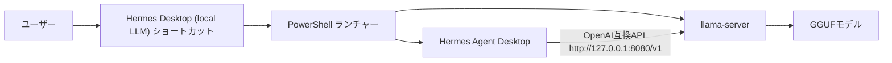

# Hermes Agent Desktop にローカルLLMを導入する手順

Hermes Agent Desktop を、LM Studio なしでローカルLLMにつなぐための手順です。

このREADMEは、Windows環境で実際にかなり苦戦しながら構築した内容をまとめています。
結論から言うと、`Hermes Agent Desktop + llama-server + GGUFモデル` の構成で動きます。

Discord DM、Obsidian、Codex skills、各種Tool useまで含めた個人メンター秘書運用は、次の詳細メモに分けています。

- [Hermes Agent Desktop を個人メンター秘書として運用する設定メモ](docs/personal-mentor-discord-obsidian-gemma4.md)

## できること

- Hermes Agent Desktop 単体でローカルLLMを使う
- LM Studioを起動せずにGGUFモデルを使う
- Hermes Desktop起動時に `llama-server` も自動起動する
- Hermes Desktopを閉じたら `llama-server` も自動終了する
- Gemma 4の思考を有効化し、制限なし寄りで動かす
- Discord DMで個人メンター秘書として使う
- Obsidian Vaultを参照し、成果物を専用フォルダへ出す
- Codex skillsをHermes側でも参照する
- `approvals.mode: off` で承認なしのYOLO運用にする

## 全体構成



`llama-server` は、llama.cppに含まれるOpenAI互換のHTTPサーバーです。
Hermes Desktop側から見ると、ローカルにあるOpenAI互換エンドポイントへ接続しているだけです。

参考:

- [llama.cpp Server documentation](https://www.mintlify.com/ggml-org/llama.cpp/inference/server)
- [unsloth/gemma-4-12b-it-GGUF](https://huggingface.co/unsloth/gemma-4-12b-it-GGUF)

## 検証環境

今回の検証環境です。

| 項目 | 内容 |
|---|---|
| OS | Windows |
| GPU | NVIDIA GeForce RTX 4070 Ti SUPER 16GB |
| Hermes Agent Desktop | v0.15.1 |
| llama.cpp | CUDA対応版 b9498 |
| モデル | `gemma-4-12b-it-Q6_K.gguf` |
| コンテキスト長 | 65536 |
| APIエンドポイント | `http://127.0.0.1:8080/v1` |

最初はQ8を使いました。
ただしQ8はVRAMがかなり厳しく、Q6_Kへ変更したところ余裕が出ました。

## 重要な結論

今回の一番大きな学びはここです。

Hermes CLI用の設定と、Hermes Desktop用の設定は別の場所を見ていることがあります。

```text
CLIで見ていた設定:
C:\Users\<USER>\.hermes\config.yaml

Desktopが見ていた設定:
C:\Users\<USER>\AppData\Local\hermes\config.yaml
```

Desktopがどの設定を読んでいるかは、次のAPIで確認できます。

```powershell
Invoke-RestMethod http://127.0.0.1:9120/api/status | ConvertTo-Json -Depth 5
```

`config_path` に出るパスが、Desktopが実際に読んでいる設定です。
ここを見ずに `.hermes\config.yaml` だけ直すと、CLIでは動くのにDesktopでは無反応になります。

## 1. GGUFモデルを用意する

今回はUnslothのGemma 4 12B Instruct GGUFを使いました。

おすすめはQ6_Kです。

```text
gemma-4-12b-it-Q6_K.gguf
```

Q8も動きましたが、16GB VRAMではかなりギリギリでした。
Q6_Kのほうが起動と運用のバランスが良いです。

配置例:

```text
C:\Users\<USER>\.cache\lm-studio\models\lmstudio-community\gemma-4-12B-it-GGUF\gemma-4-12b-it-Q6_K.gguf
```

LM Studioでダウンロードしたモデルでも、ファイルとして存在していれば使えます。
LM Studio本体を起動する必要はありません。

## 2. Gemma 4対応のllama-serverを用意する

古いllama.cppでは、Gemma 4を読み込めない場合があります。
今回、古いllama.cppでは次のようなエラーが出ました。

```text
unknown model architecture: 'gemma4'
```

この場合は、新しいllama.cppを使ってください。
今回の検証では、CUDA 12.4対応の `llama.cpp b9498` で動きました。

配置例:

```text
C:\Users\<USER>\tools\llama.cpp-b9498-cuda-12.4\llama-server.exe
```

## 3. llama-serverを起動する

最小構成は次のようなコマンドです。

```powershell
& "C:\Users\<USER>\tools\llama.cpp-b9498-cuda-12.4\llama-server.exe" `
  -m "C:\Users\<USER>\.cache\lm-studio\models\lmstudio-community\gemma-4-12B-it-GGUF\gemma-4-12b-it-Q6_K.gguf" `
  --alias gemma-4-12b-it `
  --host 127.0.0.1 `
  --port 8080 `
  --ctx-size 65536 `
  --parallel 1 `
  --reasoning on `
  --reasoning-budget -1 `
  --reasoning-format deepseek
```

ポイントは `--alias` です。
Hermes側ではこの名前をモデル名として使います。

`--reasoning on` と `--reasoning-budget -1` は、Gemma 4の思考を有効にして制限なし寄りにする設定です。
思考が不要な場合は `--reasoning off` に戻せます。

起動確認:

```powershell
Invoke-RestMethod http://127.0.0.1:8080/v1/models | ConvertTo-Json -Depth 5
```

`id` に `gemma-4-12b-it` が出ればOKです。

## 4. Hermes Desktop側のconfig.yamlを変更する

まず、Desktopが読んでいる設定ファイルを確認します。

```powershell
Invoke-RestMethod http://127.0.0.1:9120/api/status | ConvertTo-Json -Depth 5
```

今回の環境では、次のファイルでした。

```text
C:\Users\<USER>\AppData\Local\hermes\config.yaml
```

このファイルの `model` と `approvals` を次のように変更します。

```yaml
model:
  base_url: http://127.0.0.1:8080/v1
  default: gemma-4-12b-it
  provider: custom
  context_length: 65536
  api_key: not-needed

approvals:
  mode: off
```

`approvals.mode: off` は、Hermesにツール実行を承認なしで任せる設定です。
便利ですが、危険なコマンドも承認なしで実行されます。
自分だけのローカル環境で、リスクを理解したうえで使ってください。

## 5. 64Kコンテキストが必要

Hermes Agentは、モデルのコンテキスト長が短いと起動できないことがあります。
今回、32768では次のエラーが出ました。

```text
Model gemma-4-12b-it has a context window of 32,768 tokens,
which is below the minimum 64,000 required by Hermes Agent.
```

そのため、`llama-server` とHermes設定の両方を65536にしました。

`llama-server`:

```powershell
--ctx-size 65536
```

Hermes:

```yaml
model:
  context_length: 65536
```

## 6. Hermes Desktopを再起動する

設定を変更したら、Hermes Desktopを再起動します。

```powershell
Get-CimInstance Win32_Process |
  Where-Object { $_.Name -eq "Hermes.exe" } |
  ForEach-Object { Stop-Process -Id $_.ProcessId -Force }
```

その後、通常通りHermes Desktopを起動します。

## 7. 動作確認

Hermes側の認識を確認します。

```powershell
Invoke-RestMethod http://127.0.0.1:9120/api/model/info | ConvertTo-Json -Depth 5
```

期待する出力:

```json
{
  "model": "gemma-4-12b-it",
  "provider": "custom",
  "config_context_length": 65536,
  "effective_context_length": 65536
}
```

Hermes Desktopで `ハロー` と送って返事が返れば成功です。

## 8. Desktopで無反応に見えるとき

まずログを見ます。

```powershell
Get-Content "C:\Users\<USER>\AppData\Local\hermes\logs\agent.log" -Tail 100
Get-Content "C:\Users\<USER>\AppData\Local\hermes\logs\errors.log" -Tail 100
```

今回の失敗では、裏で次のエラーが出ていました。

```text
provider=copilot base_url=https://api.githubcopilot.com model=claude-opus-4.8
The requested model is not supported.
```

つまり、Desktopがまだ古い `claude-opus-4.8` を握っていました。

## 9. 既存セッションが古いモデルを握る問題

Hermes Desktopの既存チャットは、セッションDBにモデル名を持つことがあります。
設定をGemmaに変えても、古いチャットだけ `claude-opus-4.8` のまま失敗することがあります。

セッションDBの場所:

```text
C:\Users\<USER>\AppData\Local\hermes\state.db
```

確認例:

```powershell
@'
import sqlite3, json
path = r"C:\Users\<USER>\AppData\Local\hermes\state.db"
con = sqlite3.connect(path)
con.row_factory = sqlite3.Row
rows = con.execute("""
select id, source, model, billing_provider, billing_base_url, message_count, started_at
from sessions
order by started_at desc
limit 10
""").fetchall()
for row in rows:
    print(json.dumps(dict(row), ensure_ascii=False, default=str))
con.close()
'@ | py -X utf8 -
```

修正する場合は、必ずバックアップを取ってからにしてください。

```powershell
Copy-Item `
  "C:\Users\<USER>\AppData\Local\hermes\state.db" `
  "C:\Users\<USER>\AppData\Local\hermes\state.db.bak"
```

新規チャットを作るだけで回避できる場合もあります。

## 10. LM Studioを閉じる

LM Studioが同じGPUや同じモデルを握っていると、遅くなります。
今回もLM Studioや別のTTSプロセスを止めたあと、応答速度が大きく改善しました。

ローカルLLMをHermesで使うときは、GPUを使う常駐プロセスを減らしてください。

確認例:

```powershell
nvidia-smi
```

## 11. Q8からQ6_Kへ変えた理由

Q8は品質寄りですが、16GB VRAMでは余裕が少なかったです。
Q6_Kに変えると、VRAMに余裕が出ました。

今回の実測では、Q6_K起動中にRTX 4070 Ti SUPERのVRAM空きが約2.6GB残りました。
Q8ではかなりギリギリでした。

Q6_Kは、品質と速度とVRAM余裕のバランスが良い選択です。

## 12. 自動起動ショートカットを作る

毎回手動で `llama-server` を起動するのは面倒です。
そこで、次の流れをPowerShellで自動化します。

1. ショートカットを押す
2. `llama-server` を起動する
3. Hermes Desktopを起動する
4. Hermes Desktopを閉じる
5. `llama-server` も自動終了する

このリポジトリには、次のスクリプト例を入れています。

```text
scripts/start-gemma-llama-server.ps1
scripts/stop-gemma-llama-server.ps1
scripts/start-hermes-desktop-with-local-llm.ps1
scripts/watch-hermes-process-and-stop-gemma.ps1
```

まず `scripts/start-gemma-llama-server.ps1` の先頭を自分の環境に合わせます。

```powershell
$ServerExe = "C:\Users\<USER>\tools\llama.cpp-b9498-cuda-12.4\llama-server.exe"
$ModelPath = "C:\Users\<USER>\.cache\lm-studio\models\lmstudio-community\gemma-4-12B-it-GGUF\gemma-4-12b-it-Q6_K.gguf"
```

次にショートカットを作ります。

```powershell
$desktop = [Environment]::GetFolderPath("Desktop")
$shortcutPath = Join-Path $desktop "Hermes Desktop (Local LLM).lnk"
$scriptPath = "C:\Users\<USER>\path\to\scripts\start-hermes-desktop-with-local-llm.ps1"
$powershell = "C:\Windows\System32\WindowsPowerShell\v1.0\powershell.exe"
$hermesExe = "C:\Users\<USER>\AppData\Local\hermes\hermes-agent\apps\desktop\release\win-unpacked\Hermes.exe"

$shell = New-Object -ComObject WScript.Shell
$shortcut = $shell.CreateShortcut($shortcutPath)
$shortcut.TargetPath = $powershell
$shortcut.Arguments = "-NoProfile -ExecutionPolicy Bypass -WindowStyle Hidden -File `"$scriptPath`""
$shortcut.WorkingDirectory = Split-Path -Parent $hermesExe
$shortcut.IconLocation = "$hermesExe,0"
$shortcut.Description = "Start Hermes Desktop with local llama-server"
$shortcut.Save()
```

## 13. 自動起動でハマったこと

最初の自動起動スクリプトでは、`llama-server` の準備完了を待ってからHermes Desktopを開いていました。
この作りだと、モデル読み込み中に何も表示されません。
ユーザーから見ると「起動しない」ように見えます。

さらに、待ちきれずショートカットを複数回押すと、`llama-server` が二重起動しました。

対策:

- `llama-server` 起動後、すぐHermes Desktopを表示する
- モデル準備完了の確認は裏側ログで行う
- 二重ランチャーを検出して、後から起動したほうを終了する
- 既に対象モデルの `llama-server` が起動中なら再利用する

この対策を入れたものが `scripts/start-hermes-desktop-with-local-llm.ps1` です。

## 14. トラブルシュート

### Hermes Desktopが返答しない

確認するもの:

```powershell
Invoke-RestMethod http://127.0.0.1:9120/api/model/info | ConvertTo-Json -Depth 5
Invoke-RestMethod http://127.0.0.1:8080/v1/models | ConvertTo-Json -Depth 5
```

見るポイント:

- Hermesの `provider` が `custom` か
- Hermesの `model` が `gemma-4-12b-it` か
- `llama-server` の `/v1/models` に同じモデル名が出るか
- Desktopが読んでいる `config_path` が想定通りか

### `model_not_supported` が出る

Desktopが古いモデル設定を握っています。

確認:

```powershell
Get-Content "C:\Users\<USER>\AppData\Local\hermes\logs\agent.log" -Tail 100
```

`claude-opus-4.8` や `copilot` が出る場合は、Desktop側configを見直してください。

### `unknown model architecture: gemma4` が出る

llama.cppが古いです。
Gemma 4対応版に更新してください。

### 32768コンテキストで失敗する

Hermes Agentは最低64K程度を要求する場合があります。

`llama-server`:

```powershell
--ctx-size 65536
```

Hermes:

```yaml
model:
  context_length: 65536
```

### 返答が遅い

見るポイント:

- LM Studioが起動していないか
- 他のTTSやローカルLLMがGPUを使っていないか
- Q8ではなくQ6_Kを使っているか
- 初回応答でプロンプトキャッシュが効いていないだけではないか

GPU確認:

```powershell
nvidia-smi
```

## 15. 今回の学び

今回、一番時間がかかったのはモデルそのものではありません。
設定ファイル、セッションDB、既存プロセス、GPU使用状況の切り分けでした。

学びをまとめます。

- Hermes CLIとHermes Desktopは、別の `config.yaml` を読むことがある
- Desktopの実設定は `/api/status` の `config_path` で確認する
- `/v1/models` が返っても、Hermes側の設定が合っているとは限らない
- 既存チャットは古いモデル名をセッションDBに持つことがある
- Hermes Agentでは64Kコンテキストを満たす必要がある
- Gemma 4は古いllama.cppでは読めない
- Q8は動くが、16GB VRAMでは余裕が少ない
- Q6_Kはかなり現実的な選択
- LM StudioやTTSなど、GPUを握る常駐プロセスは速度に大きく影響する
- 自動起動では、モデル読み込み完了を待つより先にDesktop画面を出すほうが親切
- ショートカットは複数回押される前提で、二重起動防止が必要

## 16. 最終構成

最終的には、次の構成で安定しました。

```text
Hermes Agent Desktop
  -> provider: custom
  -> base_url: http://127.0.0.1:8080/v1
  -> model: gemma-4-12b-it
  -> context_length: 65536

llama-server
  -> model file: gemma-4-12b-it-Q6_K.gguf
  -> alias: gemma-4-12b-it
  -> port: 8080
  -> ctx-size: 65536

launcher shortcut
  -> starts llama-server
  -> starts Hermes Desktop
  -> stops llama-server when Hermes exits
```

## 注意

この手順は、個人のWindowsローカル環境での検証結果です。
Hermes Agent Desktopやllama.cppは更新が早いため、将来のバージョンでは挙動が変わる可能性があります。

また、`approvals.mode: off` は便利ですが危険です。
AIにローカル操作権限を広く渡す設定なので、作業内容とリスクを理解したうえで使ってください。
