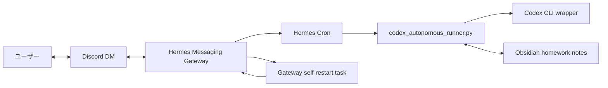

# Hermes Agent Desktop 自律実行とGateway運用メモ

このメモは、Hermes Agent DesktopをDiscord DM、Obsidian、Codex CLIとつなぎ、空き時間に宿題を進める運用を再現するための記録です。

公開リポジトリ向けなので、トークン、Discord ID、DMチャンネルID、個人ノート本文、認証ファイルの中身は載せません。
別PCで再現するときは、値を推測せず、ローカル環境で確認してください。

## 全体像



この構成の目的は、会話に出たNext Actionsを忘れず、Obsidianへ宿題としてためることです。
Hermesは5分ごとのcronで宿題を1件ずつ拾い、Codexへ投げます。
完了後はDiscordへ報告し、Obsidianの宿題ノートにも完了表示を付けます。

## 使う場所

Windowsの典型例です。

| 用途 | パス例 |
|---|---|
| Hermes設定 | `%LOCALAPPDATA%\hermes\config.yaml` |
| Hermes scripts | `%LOCALAPPDATA%\hermes\scripts` |
| Hermes cron jobs | `%LOCALAPPDATA%\hermes\cron\jobs.json` |
| Gateway状態 | `%LOCALAPPDATA%\hermes\gateway_state.json` |
| Gatewayログ | `%LOCALAPPDATA%\hermes\logs\agent.log` |
| Codex自律状態 | `%LOCALAPPDATA%\hermes\agent-autonomous-codex\active_task.json` |
| Obsidian宿題 | `%USERPROFILE%\Documents\Obsidian Vault\hermes\homework` |

`%LOCALAPPDATA%\hermes` が実際のHermes設定ディレクトリかは、次で確認します。

```powershell
Invoke-RestMethod http://127.0.0.1:9120/api/status |
  ConvertTo-Json -Depth 8
```

`config_path` に出た場所を優先してください。

## 1. Codex CLI wrapperを用意する

HermesからCodexを呼ぶ入口は、固定のPowerShell wrapperにします。
自然文だけで「Codexを使って」と書いても、Hermesが必ず実行するとは限らないからです。

配置例:

```text
%LOCALAPPDATA%\hermes\scripts\agent-pipeline.ps1
%LOCALAPPDATA%\hermes\scripts\agent-dispatch.ps1
```

基本方針:

- 既定の外部エージェントはCodexにする
- Claudeは別API費用の了承があるときだけ使う
- `agent-pipeline.ps1` はstdout、stderr、summaryをログへ残す
- prompt全文や秘密情報をログに残さないよう、redactionを入れる
- ログ保持は14日程度にする

動作確認:

```powershell
& "$env:LOCALAPPDATA\hermes\scripts\agent-dispatch.ps1" `
  -DryRun `
  -Prompt "backend API bug fix"
```

期待する結果は、Codexが選ばれることです。

## 2. Codex自律runnerを置く

配置例:

```text
%LOCALAPPDATA%\hermes\scripts\codex_autonomous_runner.py
```

runnerの役割:

- `active_task.json` で現在のCodexタスクを管理する
- 既存タスクがあるとき、新しいタスクで上書きしない
- Codexをバックグラウンド起動し、Discordへ送信済み通知を出す
- 次回cronでCodexの完了、失敗、timeoutを回収する
- Obsidian宿題キューから `status: queued` のノートを1件拾う
- 完了した宿題へ完了タグとファイル名prefixを付ける
- 完了報告をDiscordへ出す

runnerが見る状態ファイル:

```text
%LOCALAPPDATA%\hermes\agent-autonomous-codex\active_task.json
%LOCALAPPDATA%\hermes\agent-autonomous-codex\runner.lock
%LOCALAPPDATA%\hermes\agent-autonomous-codex\logs
```

自律タスクを手動で小さく試す例:

```powershell
& "$env:LOCALAPPDATA\hermes\hermes-agent\venv\Scripts\python.exe" `
  "$env:LOCALAPPDATA\hermes\scripts\codex_autonomous_runner.py" `
  --start-task "Return only AUTONOMOUS_STATUS: complete and a short report." `
  --workdir "$env:USERPROFILE" `
  --max-rounds 1 `
  --dry-run `
  --json
```

## 3. Obsidian宿題キューを作る

宿題フォルダ:

```text
%USERPROFILE%\Documents\Obsidian Vault\hermes\homework
```

宿題ノートの例:

```markdown
---
type: hermes-homework
status: queued
priority: normal
created: 2026-06-06
source: hermes-next-actions
---

# Hermes自律実行の信頼性強化

## 宿題
- Watchdogの完了回収処理を強化する
- agent-pipelineのログ保持期間と秘匿化方針を決める
- active taskの上書き防止を入れる

## 受入条件
- 構文チェックが通る
- dry runで意図した状態を返す
- Discordへ完了報告が届く
- 完了後にこのノートへ完了表示が付く
```

完了時のルール:

- frontmatterの `status` を `done` にする
- frontmatterの `tags` に `hermes/homework/done` を入れる
- 本文にも `#hermes/homework/done` を入れる
- ファイル名の先頭へ `[完了] ` を付ける
- Discordへ短い完了報告を送る

ファイル名例:

```text
[完了] 2026-06-06-hermes-autonomous-reliability.md
```

Obsidianでは、人間が見て分かる表示が大事です。
frontmatterだけでなく、本文タグとファイル名prefixも使います。

## 4. 5分cronでrunnerを動かす

`%LOCALAPPDATA%\hermes\cron\jobs.json` に、runner用jobを追加します。

例:

```json
{
  "id": "c0d3xauto5m1",
  "name": "codex-autonomous-runner-5m",
  "prompt": "",
  "skills": [],
  "skill": "",
  "script": "codex_autonomous_runner.py",
  "no_agent": true,
  "schedule": {
    "kind": "cron",
    "expr": "*/5 * * * *",
    "display": "*/5 * * * *"
  },
  "enabled": true,
  "deliver": "discord"
}
```

`no_agent: true` にすると、LLM応答を挟まずscriptのstdoutをそのまま使います。
runnerが何も報告しないときはstdoutを空にし、Discordへ不要通知を出しません。

Windowsでは、cron scheduler側のPython実行に注意します。

- `pythonw.exe` ではなく `python.exe` を優先する
- stdoutは `encoding="utf-8", errors="replace"` で読む
- 絵文字や日本語を出すscriptは、親プロセス側のdecode設定も見る

完了通知の実地確認:

```powershell
Get-ChildItem "$env:LOCALAPPDATA\hermes\cron\output\c0d3xauto5m1" |
  Sort-Object LastWriteTime -Descending |
  Select-Object -First 3

Get-Content "$env:LOCALAPPDATA\hermes\logs\agent.log" -Tail 100
```

`agent.log` に `delivered to discord` が出ていれば、HermesがDiscordへ配送しています。

## 5. Gateway自己再起動を外側Scheduled Taskで行う

Gateway自身のcronから自分を再起動する方式は弱いです。
Windowsでは、Gatewayを動かしているScheduled Taskの外側から再起動します。

配置例:

```text
%LOCALAPPDATA%\hermes\scripts\hermes_gateway_self_restart.py
%LOCALAPPDATA%\hermes\scripts\invoke-hermes-gateway-self-restart.ps1
```

役割:

- `hermes_gateway_self_restart.py` は再起動要求ファイルを作る
- `invoke-hermes-gateway-self-restart.ps1` は外側Scheduled Taskから実再起動する
- Gateway内cron `gateway-self-restart-1m` は無効にする
- 外側Scheduled Task `Hermes_Gateway_SelfRestart` を1分間隔で動かす

再起動要求ファイル:

```text
%LOCALAPPDATA%\hermes\gateway-self-restart-request.json
```

要求作成:

```powershell
& "$env:LOCALAPPDATA\hermes\hermes-agent\venv\Scripts\python.exe" `
  "$env:LOCALAPPDATA\hermes\scripts\hermes_gateway_self_restart.py" `
  --request `
  --reason "configuration refresh requested" `
  --not-before-seconds 30
```

外側Scheduled Taskの考え方:

```text
Task name:
Hermes_Gateway_SelfRestart

Action:
powershell.exe -NoProfile -ExecutionPolicy Bypass -WindowStyle Hidden -File "%LOCALAPPDATA%\hermes\scripts\invoke-hermes-gateway-self-restart.ps1"

Schedule:
1分間隔
```

再起動前に見る安全条件:

- Gatewayのactive agentsが0
- Codex自律タスクがrunningではない
- Codex runner lockが有効ではない
- 既に再起動中ではない

成功判定では、`running` だけを見ません。
再起動前後でGateway PIDが変わったかを見ます。

確認:

```powershell
$env:HERMES_CONFIG_DIR = "$env:LOCALAPPDATA\hermes"
& "$env:LOCALAPPDATA\hermes\hermes-agent\venv\Scripts\hermes.exe" gateway status

Get-Content "$env:LOCALAPPDATA\hermes\gateway-self-restart-request.json"
Get-Content "$env:LOCALAPPDATA\hermes\logs\gateway-self-restart-external.log" -Tail 50
```

## 6. Discord通知の表示ルール

Discordでは、人間が一目で状態を見分けられる表示にします。

| 状態 | 表示 |
|---|---|
| HermesからCodexへ送信 | `📤 **Hermes → Codex 送信OK**` |
| Codexから進捗を回収 | `📥 **Codex → Hermes 受信OK / 進捗**` |
| Codexから完了を回収 | `✅ **Codex → Hermes 受信OK / 完了**` |
| 停止またはブロック | `⚠️ **Codex停止**` |

Discord Bot投稿では、`:white_check_mark:` のようなshortcodeではなく、実Unicode絵文字を使います。
Bot投稿ではshortcodeが文字列のまま見えることがあるからです。

通知には、次だけを短く含めます。

- task id
- round
- 対象名
- ユーザー向けの短い報告

prompt全文、stdout/stderr全文、秘密情報はDiscordへ出しません。

## 7. Gatewayとcronの確認コマンド

Gateway:

```powershell
$env:HERMES_CONFIG_DIR = "$env:LOCALAPPDATA\hermes"
& "$env:LOCALAPPDATA\hermes\hermes-agent\venv\Scripts\hermes.exe" gateway status
```

MCP:

```powershell
$env:HERMES_CONFIG_DIR = "$env:LOCALAPPDATA\hermes"
& "$env:LOCALAPPDATA\hermes\hermes-agent\venv\Scripts\hermes.exe" mcp list
```

cron job:

```powershell
Get-Content "$env:LOCALAPPDATA\hermes\cron\jobs.json" |
  ConvertFrom-Json |
  Select-Object -ExpandProperty jobs |
  Where-Object name -eq "codex-autonomous-runner-5m"
```

最新cron出力:

```powershell
Get-ChildItem "$env:LOCALAPPDATA\hermes\cron\output\c0d3xauto5m1" |
  Sort-Object LastWriteTime -Descending |
  Select-Object -First 1 |
  ForEach-Object { Get-Content $_.FullName }
```

Discord配送ログ:

```powershell
Get-Content "$env:LOCALAPPDATA\hermes\logs\agent.log" -Tail 200 |
  Select-String "delivered to discord"
```

Codex active task:

```powershell
Get-Content "$env:LOCALAPPDATA\hermes\agent-autonomous-codex\active_task.json" |
  ConvertFrom-Json |
  ConvertTo-Json -Depth 12
```

## 8. xAI X Searchを有効にする

HermesでXの公開投稿を検索したい場合は、`x_search` を有効にします。
これはHermes Agentの高度な使い方、公開事例、最新の運用例を調べるときに便利です。

CLI向けに有効化する例:

```powershell
$env:HERMES_CONFIG_DIR = "$env:LOCALAPPDATA\hermes"
& "$env:LOCALAPPDATA\hermes\hermes-agent\venv\Scripts\hermes.exe" tools enable --platform cli x_search
```

xAI OAuthの状態確認:

```powershell
$env:HERMES_CONFIG_DIR = "$env:LOCALAPPDATA\hermes"
& "$env:LOCALAPPDATA\hermes\hermes-agent\venv\Scripts\hermes.exe" auth status xai-oauth
```

Tool有効化の確認:

```powershell
$env:HERMES_CONFIG_DIR = "$env:LOCALAPPDATA\hermes"
& "$env:LOCALAPPDATA\hermes\hermes-agent\venv\Scripts\hermes.exe" tools list --platform cli
```

期待する状態:

```text
x_search enabled
xai-oauth logged in
```

スマホでxAI OAuthを行う場合、認可後に `127.0.0.1` のcallbackへ戻れないことがあります。
その場合でも、ブラウザのアドレスバーに出たcallback URLに含まれる認可コードとstateを使えば、ローカルで交換できます。

注意点:

- OAuth tokenやcallback URL全文をGitHubへ入れない
- OAuthリンク生成後は、callbackを受け取るまでstateを再生成しない
- stateを再生成すると `state mismatch` になる
- 交換完了後は、一時stateファイルを削除する
- Discordなど他platformで使う場合は、そのplatformのtoolsetでも個別に有効化を確認する

疎通確認の考え方:

```text
1. hermes auth status xai-oauth が logged in
2. hermes tools list --platform cli で x_search enabled
3. x_search tool のrequirements checkが true
4. 軽い検索で success=true と citation が返る
```

## 9. Gateway外側watchdogを置く

Gateway内cronは、Gatewayが止まると一緒に止まります。
そのため、Gateway停止そのものを復旧したい場合は、外側のWindows Scheduled Taskで監視します。

配置例:

```text
%LOCALAPPDATA%\hermes\scripts\ensure-hermes-gateway.ps1
```

役割:

- `hermes_cli.main gateway run` の `pythonw.exe` / `python.exe` プロセスを探す
- Gatewayが動いていれば何もしない
- Gatewayが落ちていれば、既存の `Hermes_Gateway` Scheduled Taskを起動する
- 直接 `pythonw.exe` を組み立てず、既存taskを再利用する
- Mutexでwatchdog自身の多重実行を避ける
- 復旧結果を `logs\gateway-watchdog.log` に残す

Scheduled Taskの例:

```text
Task name:
Hermes_Gateway_Watchdog

Action:
powershell.exe -NoProfile -ExecutionPolicy Bypass -WindowStyle Hidden -File "%LOCALAPPDATA%\hermes\scripts\ensure-hermes-gateway.ps1"

Schedule:
5分間隔
```

確認:

```powershell
schtasks.exe /Query /TN Hermes_Gateway_Watchdog /V /FO LIST
Get-Content "$env:LOCALAPPDATA\hermes\logs\gateway-watchdog.log" -Tail 50
```

復旧の完了条件:

- Gateway停止を検知する
- watchdogが `Hermes_Gateway` taskを起動する
- Discordがconnectedになる
- Cron tickerが開始する
- `hermes gateway status` でGateway process runningになる

## 10. Discord内部思考ガードを入れる

ローカルLLMをDiscordへつなぐ場合、最終応答に内部メモが混ざることがあります。
`display.platforms.discord.streaming: false` でも、最終応答そのものに混ざる場合があります。

対策として、Discord向けの `transform_llm_output` プラグインを置きます。

配置例:

```text
%LOCALAPPDATA%\hermes\plugins\local-discord-internal-thought-guard
```

このプラグインで削る対象:

- `<think>...</think>`
- `Plan:`
- `Self-Correction`
- `tool calls`
- `final response`
- `The user is`
- `I have already`

方針:

- Discord向け最終応答だけを対象にする
- CLIやDesktopの通常応答には影響させない
- 削除後に本文が空なら、安全な短文へ差し替える
- 再発したら、実際の漏れ文をマーカーに追加する

設定例:

```yaml
plugins:
  enabled:
    - local-discord-internal-thought-guard
```

確認観点:

- PluginManagerが `transform_llm_output` フックを登録する
- 漏れサンプルから内部メモが削れる
- 通常の英語文までは過剰に削らない
- `platform=cli` では処理しない
- Gateway再起動後にDiscord connectedになる

## 11. Cron check-inへ会話文脈を渡す

Hermes Cronは新しいisolated sessionで動くため、通常会話の履歴を自動では読みません。
個人メンター秘書のcheck-inを自然にしたい場合は、pre-run scriptで当日の会話文脈を渡します。

配置例:

```text
%LOCALAPPDATA%\hermes\scripts\daily_conversation_context.py
```

scriptの考え方:

- `state.db` の `sessions` / `messages` から当日の通常会話を読む
- `source != cron` のユーザー発話だけを材料にする
- assistant文、tool文、内部思考混入っぽい文は渡さない
- 具体話題を1つだけ拾う
- 会話が古い場合や材料が弱い場合は、無理に通知しない

cron job側:

```json
{
  "name": "mentor-checkin-2100",
  "script": "daily_conversation_context.py",
  "deliver": "discord"
}
```

Windowsでは、親プロセス側のdecode方式にも注意します。
script stdoutはHermes側の読み方に合わせます。

## 12. 自律heartbeatは通知しすぎない

15分ごとの自律heartbeatは便利ですが、通知しすぎるとノイズになります。
スコアが高いだけで送らず、「いま割り込む価値があるか」を見る設計にします。

配置例:

```text
%LOCALAPPDATA%\hermes\scripts\autonomous_trigger_evaluator.py
```

抑制するもの:

- 直近通知から時間が短い
- 同じtopicが続いている
- 同じ文面を繰り返している
- 会話が古い
- 具体的な次の一手がない
- `Codex` のような広い単語だけでtopicが固定されている

設定:

```yaml
cron:
  wrap_response: false
```

`[SILENT]` の場合はDiscordへ配送しないようにします。
ログでは、cron outputと `agent.log` の delivery skip を確認します。

## 13. context圧縮は早すぎたらthresholdを見る

128K context運用で `compression.threshold: 0.5` にすると、約65K tokenで圧縮が始まります。
長いデバッグ会話では早く感じることがあります。

通常会話の継続性を優先する場合は、まず `0.75` 前後へ上げます。

```yaml
compression:
  threshold: 0.75
```

`target_ratio` は圧縮後にどれくらい縮めるかの設定です。
圧縮開始タイミングだけを変えたい場合は、まず `threshold` だけ触ります。

設定変更後:

```powershell
$env:HERMES_CONFIG_DIR = "$env:LOCALAPPDATA\hermes"
& "$env:LOCALAPPDATA\hermes\hermes-agent\venv\Scripts\hermes.exe" mcp list
& "$env:LOCALAPPDATA\hermes\hermes-agent\venv\Scripts\hermes.exe" gateway restart
```

## 14. よくある失敗

### 完了報告がDiscordへ届かない

見る場所:

- runner単体のstdout
- cron outputファイル
- `agent.log` の `delivered to discord`
- `active_task.json` の `homework_completion_report_emitted_at`

原因になりやすいもの:

- Gatewayが `pythonw.exe` で起動し、script stdoutを捕まえられない
- schedulerがCP932でUTF-8絵文字を読もうとして落ちる
- 配送前に「報告済み」フラグだけ立ってしまった

対策:

- schedulerはPython script実行時に `python.exe` を優先する
- `subprocess.run(..., text=True, encoding="utf-8", errors="replace")` にする
- 完了済み宿題は、報告済みフラグがなければ次回cronで1回だけ後追い報告する

### Gateway再起動が成功したように見えるがPIDが変わらない

`gateway_state: running` だけでは足りません。
再起動前後のGateway PIDを比較してください。

外側Scheduled Taskから `Hermes_Gateway` を止めて起動し直す方式にします。

### Obsidianで完了タグが見えない

frontmatterだけだと、人間には見えにくいです。

次を全部入れます。

- frontmatter `tags: [hermes/homework/done]`
- 本文 `#hermes/homework/done`
- ファイル名 `[完了] ...md`

### active taskが上書きされる

`active_task.json` のstatusが `queued`、`running`、`needs_followup` なら、新しいタスクで上書きしません。
明示的に置き換える場合だけ、専用フラグを使います。

### xAI OAuthでstate mismatchになる

OAuthリンクを作り直すと、PKCE stateが変わります。
ユーザーがcallback URLを貼るまでは、同じstateを保持してください。

callback URL全文は秘密情報に近い扱いです。
GitHubやチャットログへ保存しないでください。

### Gateway外側watchdogが二重起動する

Gatewayの親 `pythonw.exe` と子 `pythonw.exe` が両方見えることがあります。
これは二重起動とは限りません。

判定では、`hermes_cli.main gateway run` を含む親子プロセスをまとめて見ます。
watchdog自身はMutexで多重起動を避けます。

### Discordに内部思考が漏れる

プロンプト指示だけでは防ぎきれない場合があります。
Discord投稿前の `transform_llm_output` フィルタを使います。

再発した場合は、漏れた実文を短く抽出し、マーカーへ追加します。
長い漏えい文や個人情報は保存しません。

## 15. 完了条件

別PCで再現できたと判断する条件です。

- GatewayがScheduled Taskで起動し、Discordがconnectedになる
- `codex-autonomous-runner-5m` がenabledで5分ごとに動く
- Obsidian宿題ノート `status: queued` をrunnerが拾う
- Codexへ送信した時点でDiscordに送信OKが出る
- Codex完了後、Discordへ完了報告が出る
- Obsidian宿題ノートに本文タグと `[完了] ` prefixが付く
- Gateway自己再起動要求を作ると、外側Scheduled Taskが安全なタイミングで再起動する
- 再起動前後でGateway PIDが変わる
- `x_search` を使う場合、xAI OAuthがlogged inになり、`x_search` がenabledになる
- Gateway外側watchdogを使う場合、Gateway停止後に既存taskから復旧できる
- Discord内部思考ガードを使う場合、漏えいサンプルが投稿前に削れる
- mentor cronを使う場合、通常会話文脈がScript Outputとして渡る
- 自律heartbeatを使う場合、不要な通知は `[SILENT]` で止まる

## 16. 公開repoへ入れないもの

次は絶対にGitHubへ入れません。

- Discord Bot Token
- Discord numeric user ID
- DMチャンネルID
- xAI OAuth token
- xAI OAuth callback URL全文
- OAuth stateファイル
- `.env`
- `auth.json`
- `state.db`
- `gateway-self-restart-request.json`
- `active_task.json`
- 個人のObsidianノート本文
- Codex stdout/stderrの実ログ全文

公開してよいものは、手順、設定項目名、プレースホルダー付きサンプル、検証コマンド、トラブルシュートです。
